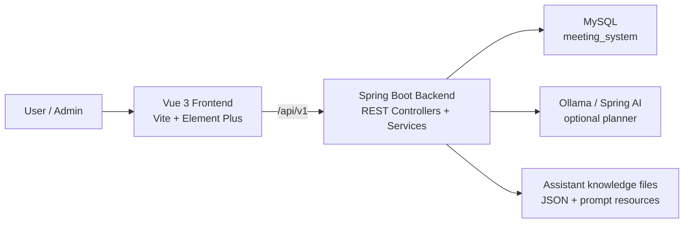

<div align="center">
  
  <h1>Meeting Room System</h1>
</div>

<p align="center">
  A full-stack meeting room reservation platform with scheduling, room management, notifications, analytics, and a controlled AI assistant.
</p>

<p align="center">
  <a href="./README.zh-CN.md">简体中文</a> |
  <span>English</span>
</p>

<p align="center">
  
  
  
  
  
  
</p>

## Overview

Meeting Room System is a real full-stack web application for organizations that need to manage meeting rooms, reservations, room devices, approval workflows, notifications, and usage statistics.

The frontend is built with Vue 3, Vite, TypeScript, Pinia, Element Plus, FullCalendar, and ECharts. The backend is a Java 21 Spring Boot application with MyBatis and MySQL. The AI assistant uses a controlled tool registry: it can understand natural language, but actual business operations still go through backend services, permission checks, validation, and confirmation.

## Features

- Room browsing with location, capacity, device, status, and availability filters.
- Reservation creation, room recommendation, calendar view, modification, cancellation, and post-meeting review.
- Personal reservation center for active, ended, and reviewable meetings.
- Notification center with unread summary, categories, read state, and admin publishing from the top navigation bell.
- Admin room management, device management, reservation review, exception handling, and statistics dashboards.
- Emergency meeting workflow for admins, including conflict preview, room reassignment, cancellation fallback, and affected-user notifications.
- AI assistant for schedule queries, room availability, reservation operations, admin tools, and system knowledge Q&A.
- Role-based frontend routes and backend API permissions.
- Frontend Vitest coverage and backend JUnit/Mockito/H2 tests.

## Preview


## Architecture



## Repository Layout

```text
meeting-room/
  frontend/                         Vue 3 frontend application
    src/common/apis/                API clients grouped by business domain
    src/pages/                      Route pages
    src/components/                 Reusable business components
    tests/                          Frontend unit and page tests

  backend/                          Maven multi-module backend workspace
    meeting-room-common/            Shared enums, result wrapper, utilities
    meeting-room-server/            REST controllers, services, mappers, AI assistant
      src/main/resources/ai/        Assistant prompt, schema, and knowledge files
      src/main/resources/sql/       SQL migration fragments
      src/test/java/                Backend tests

  start-dev.bat                     Windows helper for backend 8081 + frontend 5172
```

## Tech Stack

| Area | Stack |
| --- | --- |
| Frontend | Vue 3, Vite, TypeScript, Pinia, Vue Router, Element Plus |
| Scheduling UI | FullCalendar |
| Charts | ECharts |
| Styling | SCSS, UnoCSS |
| HTTP | Axios |
| Backend | Java 21, Spring Boot 3.5, Spring Web, Spring Validation |
| Persistence | MyBatis, MySQL Connector/J |
| AI assistant | Spring AI Ollama, local prompt/schema/knowledge resources |
| Tests | Vitest, Vue Test Utils, JUnit 5, Mockito, H2 |

## Prerequisites

- Java 21
- Maven 3.9+
- Node.js 20.19+ or 22.12+
- pnpm 10+
- MySQL 8.x
- Optional: Ollama with `qwen2.5:7b` for the LLM planner path

## Getting Started

### 1. Clone

```bash
git clone git@github.com:EternalStudying/meeting-room-system.git
cd meeting-room-system
```

### 2. Prepare MySQL

Create the schema and, optionally, import demo data:

```bash
mysql -u root -p < backend/meeting-room-server/src/main/resources/sql/schema.sql
mysql -u root -p meeting_system < backend/meeting-room-server/src/main/resources/sql/seed-demo.sql
```

The demo seed contains sample users, rooms, devices, reservations, reviews, and notifications around May 2026. Change all demo passwords before deployment.

### 3. Configure the backend

The tracked backend config is environment-variable based:

```yaml
spring:
  datasource:
    url: "jdbc:mysql://${DB_HOST:${MYSQL_HOST:${SERVER_PUBLIC_IP:localhost}}}:${DB_PORT:${MYSQL_PORT:3306}}/${DB_NAME:${MYSQL_DATABASE:meeting_system}}?useSSL=false&serverTimezone=Asia/Shanghai&allowPublicKeyRetrieval=true"
    username: "${DB_USERNAME:${MYSQL_USER:root}}"
    password: "${DB_PASSWORD:${MYSQL_PASSWORD:${MEETING_DB_PASSWORD:meeting_password}}}"
```

Recommended local variables:

| Variable | Purpose | Default |
| --- | --- | --- |
| `DB_HOST` | MySQL host | `localhost` |
| `DB_PORT` | MySQL port | `3306` |
| `DB_NAME` | Database name | `meeting_system` |
| `DB_USERNAME` | Database username | `root` |
| `DB_PASSWORD` | Database password | `meeting_password` |

You can also copy the example config if you need a local profile:

```text
backend/meeting-room-server/src/main/resources/application-example.yml
```

Local profile files such as `application-local.yml` are ignored by Git.

### 4. Optional AI configuration

By default, the backend expects Ollama at:

```text
http://127.0.0.1:11434
```

with model:

```text
qwen2.5:7b
```

If Ollama is unavailable, disable the LLM planner and use deterministic fallback:

```yaml
assistant:
  ai:
    enabled: false
```

Spring Boot environment variables such as `ASSISTANT_AI_ENABLED=false` can also be used.

### 5. Start the backend

From the repository root:

```bash
cd backend
mvn -N -DskipTests install
mvn -pl meeting-room-common clean install -DskipTests "-Dspring-boot.repackage.skip=true"
mvn -pl meeting-room-server spring-boot:run "-Dspring-boot.run.arguments=--server.port=8081"
```

Backend URL:

```text
http://localhost:8081
```

### 6. Start the frontend

Open another terminal:

```bash
cd frontend
pnpm install
pnpm dev:5172
```

Frontend URL:

```text
http://localhost:5172
```

The frontend development server proxies `/api/v1` to `http://127.0.0.1:8081`.

### Windows helper

After dependencies and backend configuration are ready, Windows users can start both sides from the repository root:

```bat
start-dev.bat
```

This opens the backend on `8081` and the frontend on `5172`.

## Demo Accounts

If your local demo database contains the provided demo users, these accounts are commonly used:

| Role | Username | Password |
| --- | --- | --- |
| Admin | `admin` | `123456` |
| User | `zhangsan` | `123456` |

These credentials are for local demo data only. Do not use them with a public database or any deployed environment.

## Common Commands

Frontend:

```bash
cd frontend
pnpm dev:5172
pnpm test -- --run
pnpm build
pnpm build:staging
```

Backend:

```bash
cd backend
mvn -pl meeting-room-server test
mvn -pl meeting-room-server spring-boot:run "-Dspring-boot.run.arguments=--server.port=8081"
```

Known note: the frontend build may still print an existing `%VITE_APP_TITLE%` warning.

## API Overview

| Area | Base Path |
| --- | --- |
| Auth | `/api/v1/auth` |
| Current user and user search | `/api/v1/users` |
| Dashboard | `/api/v1/dashboard` |
| Rooms | `/api/v1/rooms` |
| Reservations | `/api/v1/reservations` |
| Notifications | `/api/v1/notifications` |
| AI assistant | `/api/v1/ai/assistant` |
| Legacy AI chat | `/api/v1/ai/chat` |
| Admin rooms | `/api/v1/admin/rooms` |
| Admin devices | `/api/v1/admin/devices` |
| Admin reservations | `/api/v1/admin/reservations` |
| Admin emergency reservations | `/api/v1/admin/emergency-reservations` |
| Admin notifications | `/api/v1/admin/notifications` |
| Admin statistics | `/api/v1/admin/stats` |
| Admin device statistics | `/api/v1/admin/device-stats` |

## AI Assistant

The assistant is built as a controlled business executor, not an unrestricted chatbot.

- Tool Registry defines available tools, required fields, permissions, read/write type, and confirmation rules.
- The planner attempts structured LLM parsing first.
- Invalid, low-confidence, or unavailable LLM output falls back to deterministic parsing.
- RAG is used for system knowledge and operation guidance only.
- Write operations return a confirmation card before execution.
- Confirmation uses frozen parameters so later conversation turns do not silently change the pending action.

Example supported user requests:

- "What meetings do I have today?"
- "What meetings did I attend last week?"
- "Which rooms are available tomorrow from 9 to 11?"
- "Cancel my meeting tomorrow afternoon."
- "Create an emergency meeting and handle conflicts." administrator only

## Security Notes

- Do not commit production database credentials, production AI endpoints, tokens, or local profile files.
- Rotate any credential that was ever committed before publishing a repository.
- Demo accounts and demo passwords are for local testing only.
- Admin-only workflows are enforced both by frontend visibility and backend permissions.

## Contributing

Issues and pull requests are welcome. For meaningful changes, please include:

- A clear description of the problem or feature.
- The affected frontend/backend area.
- Targeted tests or a manual verification note.
- Screenshots for UI changes when relevant.

## License

This project is released under the [MIT License](./LICENSE). The frontend also retains the original MIT notice for the upstream template in [frontend/LICENSE](./frontend/LICENSE).
