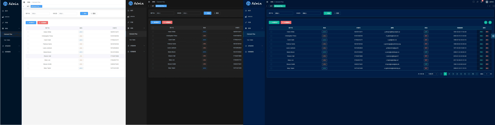
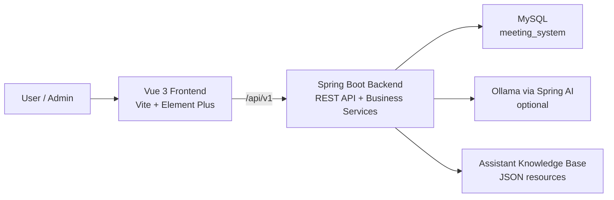

<div align="center">
  
  <h1>Meeting Room System</h1>
</div>

<p align="center">
  AI-assisted meeting room reservation, scheduling, administration, and analytics platform.
</p>

<p align="center">
  <a href="./README.zh-CN.md">简体中文</a> |
  <span>English</span>
</p>

<p align="center">
  
  
  
  
  
  
</p>

## Overview

Meeting Room System is a full-stack web application for managing meeting rooms, reservations, devices, notifications, and operational statistics. It includes regular user workflows, administrator workflows, and an AI assistant that can understand natural language requests such as checking schedules, finding available rooms, creating or cancelling reservations, and helping administrators handle approval or emergency meeting scenarios.

The project is built with a Vue 3 + Vite frontend and a Spring Boot + MyBatis backend. The backend integrates Spring AI with Ollama for structured planning, while keeping deterministic fallback logic for common business requests.

## Highlights

- Meeting room discovery with location, capacity, device, status, and availability filters.
- Reservation creation, recommendation, update, cancellation, calendar view, and post-meeting review.
- Drag-to-adjust calendar scheduling for editable reservations.
- Personal reservation center covering active, ended, and reviewable meetings.
- Notification center with unread summary, categorized messages, and admin notice publishing from the top navigation bell.
- Admin workspace for rooms, devices, reservation approval, exception handling, device binding statistics, and usage analytics.
- Emergency meeting workflow for administrators, including conflict preview, room reassignment, cancellation fallback, and user notifications.
- AI assistant with Tool Registry, LLM-first planning, RAG knowledge answers, deterministic fallback, slot collection, write-operation confirmation, and frozen execution parameters.
- Role-based route and API permission checks.
- Frontend unit/page tests and backend service/controller tests.

## Preview



## Architecture



## Tech Stack

### Frontend

- Vue 3, Vite, TypeScript
- Element Plus, Pinia, Vue Router
- Axios, FullCalendar, ECharts, UnoCSS, SCSS
- Vitest and Vue Test Utils

### Backend

- Java 21, Spring Boot 3.5
- Spring Web, Spring Validation
- MyBatis, MySQL Connector/J
- Spring AI Ollama
- JUnit 5, Mockito, H2 for tests

## Project Structure

```text
meeting-room/
  frontend/                         Vue 3 frontend application
    src/common/apis/                API clients grouped by business domain
    src/pages/                      Route pages
    src/components/                 Business components
    tests/                          Frontend unit and page tests

  backend/                          Spring Boot backend workspace
    meeting-room-common/            Shared enums, result wrapper, utilities
    meeting-room-server/            REST controllers, services, mappers, AI assistant
      src/main/resources/ai/        Assistant prompt, schema, and knowledge files
      src/main/resources/sql/       SQL migration fragments
      src/test/java/                Backend tests

  docs/superpowers/                 Product specs and implementation plans
  start-dev.bat                     Windows helper script for frontend + backend
```

## Prerequisites

- Java 21
- Maven 3.9+
- Node.js 20.19+ or 22.12+
- pnpm 10+
- MySQL 8.x
- Optional: Ollama with `qwen2.5:7b` for the LLM planner path

## Quick Start

### 1. Clone the repository

```bash
git clone git@github.com:EternalStudying/meeting-room-system.git
cd meeting-room-system
```

### 2. Configure the backend

Edit:

```text
backend/meeting-room-server/src/main/resources/application.yml
```

Set your own MySQL connection:

```yaml
spring:
  datasource:
    url: jdbc:mysql://localhost:3306/meeting_system?useSSL=false&serverTimezone=Asia/Shanghai&allowPublicKeyRetrieval=true
    username: your_user
    password: your_password
```

If Ollama is not available, disable the LLM planner and use deterministic fallback:

```yaml
assistant:
  ai:
    enabled: false
```

### 3. Start the backend

From the repository root:

```bash
cd backend
mvn -N -DskipTests install
mvn -pl meeting-room-common clean install -DskipTests "-Dspring-boot.repackage.skip=true"
mvn -pl meeting-room-server spring-boot:run "-Dspring-boot.run.arguments=--server.port=8081"
```

The backend will be available at:

```text
http://localhost:8081
```

### 4. Start the frontend

Open a new terminal:

```bash
cd frontend
pnpm install
pnpm dev:5172
```

The frontend will be available at:

```text
http://localhost:5172
```

The frontend development server proxies `/api/v1` to `http://127.0.0.1:8081`.

### Windows helper script

After installing frontend dependencies and configuring the backend, you can also run:

```bat
start-dev.bat
```

It opens the backend on port `8081` and the frontend on port `5172`.

## Demo Accounts

When the demo seed data is imported, the following accounts are commonly used:

| Role | Username | Password |
| --- | --- | --- |
| Admin | `admin` | `123456` |
| User | `zhangsan` | `123456` |

Change or remove these accounts before using the system outside a local/demo environment.

## Common Commands

### Frontend

```bash
cd frontend
pnpm dev:5172
pnpm test -- --run
pnpm build
pnpm build:staging
```

### Backend

```bash
cd backend
mvn -pl meeting-room-server test
mvn -pl meeting-room-server spring-boot:run "-Dspring-boot.run.arguments=--server.port=8081"
```

## API Overview

| Area | Base Path |
| --- | --- |
| Auth | `/api/v1/auth` |
| Current user and user search | `/api/v1/users` |
| Dashboard | `/api/v1/dashboard` |
| Rooms | `/api/v1/rooms` |
| Reservations | `/api/v1/reservations` |
| Notifications | `/api/v1/notifications` |
| AI assistant | `/api/v1/ai/assistant` |
| Legacy AI chat | `/api/v1/ai/chat` |
| Admin rooms | `/api/v1/admin/rooms` |
| Admin devices | `/api/v1/admin/devices` |
| Admin reservations | `/api/v1/admin/reservations` |
| Admin emergency reservations | `/api/v1/admin/emergency-reservations` |
| Admin notifications | `/api/v1/admin/notifications` |
| Admin statistics | `/api/v1/admin/stats` |
| Admin device statistics | `/api/v1/admin/device-stats` |

## AI Assistant Design

The assistant is designed as a controlled business executor rather than a free-form chatbot:

- The Tool Registry defines available tools, permissions, read/write type, required fields, and confirmation rules.
- The planner attempts LLM-based structured parsing first.
- Invalid, low-confidence, or unavailable LLM results fall back to deterministic parsing.
- RAG is used for system knowledge and operation guidance, not for directly executing business actions.
- Write operations return a confirmation card before execution.
- Confirmation uses frozen parameters so later conversation turns do not silently change the pending action.

Related design documents:

- [AI assistant full capability roadmap](./docs/superpowers/plans/2026-05-13-ai-assistant-full-capability-roadmap.md)
- [Planner + RAG v2 implementation plan](./docs/superpowers/plans/2026-05-14-ai-assistant-planner-rag-v2-implementation.md)
- [Emergency meeting preemption design](./docs/superpowers/specs/2026-05-15-emergency-meeting-preemption-design.md)
- [Admin notification publish dialog design](./docs/superpowers/specs/2026-05-15-admin-notification-publish-dialog-design.md)

## Configuration Notes

- `backend/meeting-room-server/src/main/resources/application.yml` contains the backend runtime configuration.
- `frontend/.env.development` sets `VITE_BASE_URL=/api/v1`, hash routing, and the application title.
- The backend default port in `application.yml` is `8080`; the development scripts and README commands run it on `8081`.
- Do not commit production database credentials or production AI service endpoints.

## Publishing Notes

Before publishing this repository publicly:

- Replace any local or demo database credentials.
- Add a root `LICENSE` file if you want the whole repository to be distributed under a specific license.
- Confirm whether demo accounts and seed data should remain available.
- Add screenshots or a hosted demo link if you want a more product-oriented GitHub landing page.

## License

This repository currently does not include a root license file. Add one before distributing or reusing the full project publicly.

