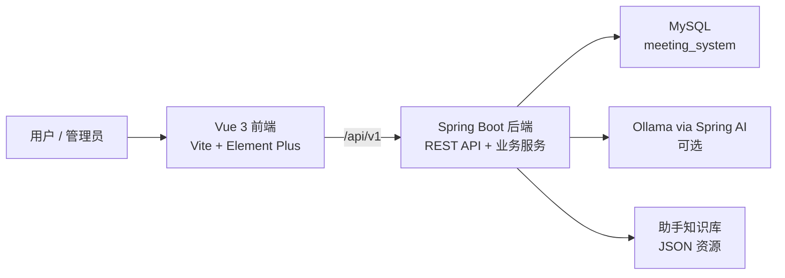

<div align="center">
  
  <h1>智能会议室管理系统</h1>
</div>

<p align="center">
  面向会议室预约、排期协同、后台管理和运营统计的 AI 辅助全栈系统。
</p>

<p align="center">
  <span>简体中文</span> |
  <a href="./README.md">English</a>
</p>

<p align="center">
  
  
  
  
  
  
</p>

## 项目简介

智能会议室管理系统是一个用于管理会议室、预约、设备、通知和运营数据的全栈 Web 应用。系统覆盖普通用户侧和管理员侧流程，并提供 AI 助手，支持通过自然语言查询日程、查找可用会议室、创建或取消预约，以及辅助管理员处理审批和紧急会议抢占调配。

项目采用 Vue 3 + Vite 前端和 Spring Boot + MyBatis 后端。后端通过 Spring AI 对接 Ollama 做结构化 Planner，同时为常见业务请求保留确定性兜底逻辑。

## 核心能力

- 会议室检索：支持地点、容量、设备、状态和可用性筛选。
- 预约全流程：创建、推荐、修改、取消、日历查看和会后评价。
- 日历排期：可对允许编辑的预约进行拖拽调整。
- 我的预约：管理进行中、已结束和待评价会议。
- 通知中心：未读摘要、分类消息、顶部铃铛通知弹层和管理员通知发布。
- 管理端：会议室、设备、预约审批、异常处理、设备绑定统计和运营分析。
- 紧急会议：管理员可预览冲突、调配可替代会议室、取消不可调配预约并通知相关用户。
- AI 助手：Tool Registry、LLM 优先 Planner、RAG 知识问答、确定性兜底、参数补全、写操作确认和冻结执行参数。
- 权限控制：前端路由和后端接口均按角色控制。
- 测试覆盖：包含前端单元/页面测试和后端服务/控制器测试。

## 项目预览


## 架构概览



## 技术栈

### 前端

- Vue 3、Vite、TypeScript
- Element Plus、Pinia、Vue Router
- Axios、FullCalendar、ECharts、UnoCSS、SCSS
- Vitest、Vue Test Utils

### 后端

- Java 21、Spring Boot 3.5
- Spring Web、Spring Validation
- MyBatis、MySQL Connector/J
- Spring AI Ollama
- JUnit 5、Mockito、H2 测试库

## 目录结构

```text
meeting-room/
  frontend/                         Vue 3 前端应用
    src/common/apis/                按业务域划分的接口模块
    src/pages/                      路由页面
    src/components/                 业务组件
    tests/                          前端单元和页面测试

  backend/                          Spring Boot 后端工作区
    meeting-room-common/            公共枚举、响应封装、工具类
    meeting-room-server/            REST 控制器、服务、Mapper、AI 助手
      src/main/resources/ai/        助手 prompt、schema 和知识库文件
      src/main/resources/sql/       SQL 变更片段
      src/test/java/                后端测试

  docs/superpowers/                 产品规格和实施计划
  start-dev.bat                     Windows 前后端联合启动脚本
```

## 环境要求

- Java 21
- Maven 3.9+
- Node.js 20.19+ 或 22.12+
- pnpm 10+
- MySQL 8.x
- 可选：Ollama，并准备 `qwen2.5:7b` 模型，用于 LLM Planner 路径

## 快速开始

### 1. 克隆项目

```bash
git clone git@github.com:EternalStudying/meeting-room-system.git
cd meeting-room-system
```

### 2. 配置后端

编辑：

```text
backend/meeting-room-server/src/main/resources/application.yml
```

配置自己的 MySQL 连接：

```yaml
spring:
  datasource:
    url: jdbc:mysql://localhost:3306/meeting_system?useSSL=false&serverTimezone=Asia/Shanghai&allowPublicKeyRetrieval=true
    username: your_user
    password: your_password
```

如果本机没有 Ollama，可以关闭 LLM Planner，使用确定性兜底能力：

```yaml
assistant:
  ai:
    enabled: false
```

### 3. 启动后端

在仓库根目录执行：

```bash
cd backend
mvn -N -DskipTests install
mvn -pl meeting-room-common clean install -DskipTests "-Dspring-boot.repackage.skip=true"
mvn -pl meeting-room-server spring-boot:run "-Dspring-boot.run.arguments=--server.port=8081"
```

后端地址：

```text
http://localhost:8081
```

### 4. 启动前端

打开新终端：

```bash
cd frontend
pnpm install
pnpm dev:5172
```

前端地址：

```text
http://localhost:5172
```

前端开发服务器会将 `/api/v1` 代理到 `http://127.0.0.1:8081`。

### Windows 一键启动脚本

安装前端依赖并完成后端配置后，也可以直接执行：

```bat
start-dev.bat
```

该脚本会分别在 `8081` 和 `5172` 启动后端与前端。

## 演示账号

导入演示数据后，常用账号如下：

| 角色 | 用户名 | 密码 |
| --- | --- | --- |
| 管理员 | `admin` | `123456` |
| 普通用户 | `zhangsan` | `123456` |

在本地或演示环境之外使用前，请修改或删除这些账号。

## 常用命令

### 前端

```bash
cd frontend
pnpm dev:5172
pnpm test -- --run
pnpm build
pnpm build:staging
```

### 后端

```bash
cd backend
mvn -pl meeting-room-server test
mvn -pl meeting-room-server spring-boot:run "-Dspring-boot.run.arguments=--server.port=8081"
```

## API 概览

| 模块 | 基础路径 |
| --- | --- |
| 登录鉴权 | `/api/v1/auth` |
| 当前用户和用户搜索 | `/api/v1/users` |
| 概览看板 | `/api/v1/dashboard` |
| 会议室 | `/api/v1/rooms` |
| 预约 | `/api/v1/reservations` |
| 通知 | `/api/v1/notifications` |
| AI 助手 | `/api/v1/ai/assistant` |
| 旧版 AI 聊天 | `/api/v1/ai/chat` |
| 管理端会议室 | `/api/v1/admin/rooms` |
| 管理端设备 | `/api/v1/admin/devices` |
| 管理端预约 | `/api/v1/admin/reservations` |
| 管理端紧急会议 | `/api/v1/admin/emergency-reservations` |
| 管理端通知发布 | `/api/v1/admin/notifications` |
| 管理端统计 | `/api/v1/admin/stats` |
| 管理端设备统计 | `/api/v1/admin/device-stats` |

## AI 助手设计

本项目的 AI 助手不是自由聊天机器人，而是受控的业务执行器：

- Tool Registry 显式声明工具、权限、读写类型、必填字段和确认规则。
- Planner 优先尝试 LLM 结构化解析。
- LLM 不可用、低置信、非法 JSON 或工具不匹配时，回退到确定性解析。
- RAG 只用于系统知识和操作说明，不直接执行业务写操作。
- 写操作先返回确认卡片，用户确认后才执行。
- 确认执行使用冻结参数，后续对话不会静默修改待执行动作。

相关设计文档：

- [AI 助手完整能力路线图](./docs/superpowers/plans/2026-05-13-ai-assistant-full-capability-roadmap.md)
- [Planner + RAG v2 实施计划](./docs/superpowers/plans/2026-05-14-ai-assistant-planner-rag-v2-implementation.md)
- [紧急会议抢占调配设计](./docs/superpowers/specs/2026-05-15-emergency-meeting-preemption-design.md)
- [管理员通知发布弹窗设计](./docs/superpowers/specs/2026-05-15-admin-notification-publish-dialog-design.md)

## 配置说明

- `backend/meeting-room-server/src/main/resources/application.yml` 是后端运行配置。
- `frontend/.env.development` 配置了 `VITE_BASE_URL=/api/v1`、hash 路由和应用标题。
- 后端 `application.yml` 默认端口是 `8080`；开发脚本和本 README 的命令使用 `8081`。
- 不要提交生产数据库账号、密码或生产 AI 服务地址。

## 发布到 GitHub 前建议

- 替换本地或演示数据库凭据。
- 如果希望整个仓库以明确协议开源，请在根目录添加 `LICENSE` 文件。
- 确认是否保留演示账号和演示数据说明。
- 如果希望 README 更像产品主页，可以继续补充更多截图或在线演示地址。

## License

当前仓库根目录还没有 `LICENSE` 文件。公开发布、分发或复用完整项目之前，建议先补充明确的开源协议。

