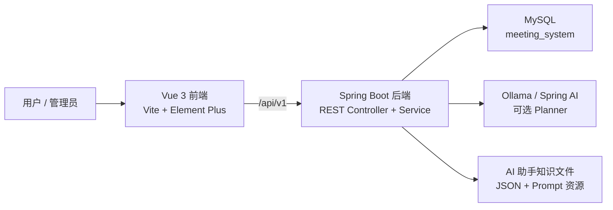

<div align="center">
  
  <h1>Meeting Room System</h1>
</div>

<p align="center">
  一个完整的会议室预约管理系统，包含日程预约、会议室管理、通知、数据统计和受控 AI 助手。
</p>

<p align="center">
  <span>简体中文</span> |
  <a href="./README.md">English</a>
</p>

<p align="center">
  
  
  
  
  
  
</p>

## 项目简介

Meeting Room System 是一个真实可运行的全栈会议室管理系统，面向组织内部的会议室预约、会议室设备管理、预约审批、通知提醒和数据统计等场景。

前端使用 Vue 3、Vite、TypeScript、Pinia、Element Plus、FullCalendar 和 ECharts。后端使用 Java 21、Spring Boot、MyBatis 和 MySQL。AI 助手采用受控工具注册表设计：它可以理解自然语言，但真正的业务操作仍然通过后端服务、权限校验、参数校验和确认流程执行。

## 功能特性

- 会议室浏览，支持按位置、容量、设备、状态和可用时间筛选。
- 预约创建、会议室推荐、日历查看、预约修改、取消和会后评价。
- 个人预约中心，覆盖进行中、已结束和待评价会议。
- 通知中心，支持未读汇总、分类消息、已读状态和管理员顶部铃铛发布通知。
- 管理端会议室管理、设备管理、预约审核、异常处理和统计看板。
- 管理员紧急会议流程，支持冲突预览、会议室调配、无法调配时取消冲突预约并通知相关用户。
- AI 助手支持日程查询、会议室可用性查询、预约操作、管理员工具和系统知识问答。
- 前端路由权限和后端接口权限控制。
- 前端 Vitest 测试和后端 JUnit/Mockito/H2 测试。

## 预览


## 架构



## 仓库结构

```text
meeting-room/
  frontend/                         Vue 3 前端应用
    src/common/apis/                按业务域划分的接口模块
    src/pages/                      路由页面
    src/components/                 可复用业务组件
    tests/                          前端单元和页面测试

  backend/                          Maven 多模块后端工程
    meeting-room-common/            公共枚举、响应封装、工具类
    meeting-room-server/            REST 控制器、服务、Mapper、AI 助手
      src/main/resources/ai/        AI 助手 prompt、schema 和知识库文件
      src/main/resources/sql/       SQL 变更片段
      src/test/java/                后端测试

  start-dev.bat                     Windows 一键启动后端 8081 + 前端 5172
```

## 技术栈

| 模块 | 技术 |
| --- | --- |
| 前端 | Vue 3, Vite, TypeScript, Pinia, Vue Router, Element Plus |
| 日程 UI | FullCalendar |
| 图表 | ECharts |
| 样式 | SCSS, UnoCSS |
| HTTP | Axios |
| 后端 | Java 21, Spring Boot 3.5, Spring Web, Spring Validation |
| 持久化 | MyBatis, MySQL Connector/J |
| AI 助手 | Spring AI Ollama, 本地 prompt/schema/knowledge 资源 |
| 测试 | Vitest, Vue Test Utils, JUnit 5, Mockito, H2 |

## 环境要求

- Java 21
- Maven 3.9+
- Node.js 20.19+ 或 22.12+
- pnpm 10+
- MySQL 8.x
- 可选：Ollama + `qwen2.5:7b`，用于 LLM Planner 路径

## 快速开始

### 1. 克隆仓库

```bash
git clone git@github.com:EternalStudying/meeting-room-system.git
cd meeting-room-system
```

### 2. 准备 MySQL

创建表结构，并按需导入演示数据：

```bash
mysql -u root -p < backend/meeting-room-server/src/main/resources/sql/schema.sql
mysql -u root -p meeting_system < backend/meeting-room-server/src/main/resources/sql/seed-demo.sql
```

演示数据包含 2026 年 5 月前后的用户、会议室、设备、预约、评价和通知。部署前请修改所有演示账号密码。

### 3. 配置后端

当前跟踪在 Git 中的后端配置优先读取环境变量：

```yaml
spring:
  datasource:
    url: "jdbc:mysql://${DB_HOST:${MYSQL_HOST:${SERVER_PUBLIC_IP:localhost}}}:${DB_PORT:${MYSQL_PORT:3306}}/${DB_NAME:${MYSQL_DATABASE:meeting_system}}?useSSL=false&serverTimezone=Asia/Shanghai&allowPublicKeyRetrieval=true"
    username: "${DB_USERNAME:${MYSQL_USER:root}}"
    password: "${DB_PASSWORD:${MYSQL_PASSWORD:${MEETING_DB_PASSWORD:meeting_password}}}"
```

推荐本地环境变量：

| 变量 | 作用 | 默认值 |
| --- | --- | --- |
| `DB_HOST` | MySQL 主机 | `localhost` |
| `DB_PORT` | MySQL 端口 | `3306` |
| `DB_NAME` | 数据库名 | `meeting_system` |
| `DB_USERNAME` | 数据库用户名 | `root` |
| `DB_PASSWORD` | 数据库密码 | `meeting_password` |

如果需要本地 profile，可以参考：

```text
backend/meeting-room-server/src/main/resources/application-example.yml
```

`application-local.yml` 等本地配置文件已被 Git 忽略。

### 4. 可选 AI 配置

默认情况下，后端会尝试连接本机 Ollama：

```text
http://127.0.0.1:11434
```

默认模型：

```text
qwen2.5:7b
```

如果没有安装 Ollama，可以关闭 LLM Planner，使用确定性兜底解析：

```yaml
assistant:
  ai:
    enabled: false
```

也可以使用 Spring Boot 环境变量，例如 `ASSISTANT_AI_ENABLED=false`。

### 5. 启动后端

在仓库根目录执行：

```bash
cd backend
mvn -N -DskipTests install
mvn -pl meeting-room-common clean install -DskipTests "-Dspring-boot.repackage.skip=true"
mvn -pl meeting-room-server spring-boot:run "-Dspring-boot.run.arguments=--server.port=8081"
```

后端地址：

```text
http://localhost:8081
```

### 6. 启动前端

打开新的终端：

```bash
cd frontend
pnpm install
pnpm dev:5172
```

前端地址：

```text
http://localhost:5172
```

前端开发服务器会将 `/api/v1` 代理到 `http://127.0.0.1:8081`。

### Windows 一键启动

依赖安装和后端配置完成后，Windows 用户可以在仓库根目录执行：

```bat
start-dev.bat
```

该脚本会分别启动后端 `8081` 和前端 `5172`。

## 演示账号

如果你的本地演示数据库包含演示用户，常用账号如下：

| 角色 | 用户名 | 密码 |
| --- | --- | --- |
| 管理员 | `admin` | `123456` |
| 普通用户 | `zhangsan` | `123456` |

这些账号只用于本地演示数据。不要在公网数据库或部署环境中使用这些默认凭据。

## 常用命令

前端：

```bash
cd frontend
pnpm dev:5172
pnpm test -- --run
pnpm build
pnpm build:staging
```

后端：

```bash
cd backend
mvn -pl meeting-room-server test
mvn -pl meeting-room-server spring-boot:run "-Dspring-boot.run.arguments=--server.port=8081"
```

已知说明：前端构建时可能仍会输出已有的 `%VITE_APP_TITLE%` 警告。

## API 概览

| 模块 | 基础路径 |
| --- | --- |
| 登录认证 | `/api/v1/auth` |
| 当前用户和用户搜索 | `/api/v1/users` |
| 工作台概览 | `/api/v1/dashboard` |
| 会议室 | `/api/v1/rooms` |
| 预约 | `/api/v1/reservations` |
| 通知 | `/api/v1/notifications` |
| AI 助手 | `/api/v1/ai/assistant` |
| 旧 AI Chat | `/api/v1/ai/chat` |
| 管理端会议室 | `/api/v1/admin/rooms` |
| 管理端设备 | `/api/v1/admin/devices` |
| 管理端预约 | `/api/v1/admin/reservations` |
| 管理端紧急会议 | `/api/v1/admin/emergency-reservations` |
| 管理端通知 | `/api/v1/admin/notifications` |
| 管理端统计 | `/api/v1/admin/stats` |
| 管理端设备统计 | `/api/v1/admin/device-stats` |

## AI 助手

AI 助手是受控业务执行器，不是不受限制的自由聊天机器人。

- Tool Registry 定义可用工具、必填字段、权限、读写类型和确认规则。
- Planner 优先尝试 LLM 结构化解析。
- LLM 输出非法、低置信或不可用时，回退到确定性解析。
- RAG 只用于系统知识和操作说明，不直接执行业务写操作。
- 写操作会先返回确认卡片，用户确认后才执行。
- 确认执行使用冻结参数，后续对话不会静默修改待执行动作。

支持的自然语言示例：

- “今天有哪些会？”
- “上周我参加了哪些会议？”
- “明天 9 点到 11 点有哪些会议室可以用？”
- “取消明天下午那个会议。”
- “创建一个紧急会议并处理冲突。”仅管理员

## 安全说明

- 不要提交生产数据库账号、密码、生产 AI 服务地址、token 或本地 profile 配置。
- 任何曾经进入过 Git 历史的凭据都应视为已泄露并及时轮换。
- 演示账号和演示密码只允许用于本地测试。
- 管理员能力同时通过前端可见性和后端权限校验控制。

## 贡献

欢迎提交 issue 和 pull request。较大的改动建议包含：

- 清晰的问题或功能说明。
- 影响到的前端/后端范围。
- 对应测试或手工验证说明。
- UI 改动的截图。

## License

本项目采用 [MIT License](./LICENSE)。前端目录仍保留上游模板的 MIT 版权声明：[frontend/LICENSE](./frontend/LICENSE)。
