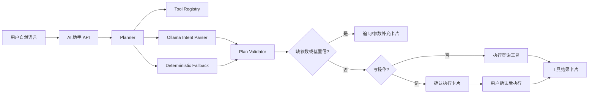

# AI 助手 Planner 重构规格

## 背景

当前 AI 助手存在可靠性问题：用户询问“今天有哪些会”可以得到回答，但询问“明天有哪些会”时，前端可能显示“当前消息服务暂时不可用，你可以稍后重试。”这说明助手链路把用户暴露给了模型、接口或解析失败，而不是稳定地完成系统任务。

现有代码中同时存在结构化助手链路和聊天链路，且意图分流仍依赖较多字符串匹配。继续补关键词只能缓解单个问题，不能支撑“全系统操作入口”的目标。

## 目标

长期目标是让 AI 助手成为系统操作入口：用户可以用自然语言在权限范围内完成系统已有功能。

第一阶段目标是重构为“混合 Planner 架构”，覆盖当前已有助手动作全集，并消除模型失败导致的中断体验。

## 已确认决策

- 目标范围：最终成为全系统操作入口。
- 第一阶段范围：覆盖当前已有助手动作全集。
- 模型接入：继续使用本地 Ollama，不接外部大模型 API。
- 降级策略：Ollama 不可用、超时或返回非法结果时，不能让用户看到“消息服务暂时不可用”；系统应使用确定性兜底或追问。
- 写操作安全：所有会改变数据的操作必须先返回确认卡片，用户确认后才执行。
- 前后端协议：允许重做。
- 前端形态：聊天主界面 + 工具卡片。
- RAG 定位：第一阶段不是主干，只作为后续知识问答增强方向。

## 非目标

- 第一阶段不接入外部大模型 API。
- 第一阶段不要求覆盖设备管理、通知发布、统计深度分析等当前助手尚未覆盖的新增工具。
- 第一阶段不以 RAG 作为操作执行主路径。
- 不继续扩大零散关键词 if/contains 链作为核心架构。

## 当前问题判断

现有问题不是单个“明天”关键词缺失，而是整体链路存在三个风险：

1. 意图识别不稳定：自然语言近义表达容易走到不同 action 或触发低置信模型解析。
2. 模型失败外泄：Ollama 超时、未启动或返回非法 JSON 时，前端可能展示通用不可用文案。
3. 职责边界混乱：`ai/assistant` 与 `ai/chat` 两套能力并存，页面能力和后端能力没有统一到一个可扩展执行框架。

## 目标架构

采用混合 Planner 架构：



### Planner

Planner 是后端统一入口，负责把用户输入转换为可执行计划。

Planner 职责：
- 读取工具注册表。
- 调用 Ollama 做结构化解析。
- 在模型不可用或结果不可信时走确定性兜底。
- 校验工具名、参数 schema、权限、确认策略。
- 判断缺失字段并生成追问。
- 对写操作生成确认卡片。
- 对读操作直接执行并返回结果卡片。

### Tool Registry

后端维护显式工具注册表。每个工具至少包含：

- `toolName`
- `description`
- `category`
- `operationType`: `read` 或 `write`
- `requiredPermission`
- `confirmRequired`
- `parametersSchema`
- `requiredFields`
- `executor`
- `resultCardType`

工具执行必须调用现有业务 service，不允许模型直接操作数据库。

### Ollama Intent Parser

Ollama 只做自然语言理解，输出结构化 plan。它不能直接执行操作。

输出结果至少包含：
- `toolName`
- `confidence`
- `parameters`
- `missingFields`
- `clarificationQuestion`

如果输出非法 JSON、工具不存在、参数不符合 schema、置信度不足，则 Planner 不信任该结果，转入确定性兜底或追问。

### Deterministic Fallback

确定性兜底不是扩大关键词链，而是为高频、低歧义任务提供稳定解析规则。

第一阶段必须稳定覆盖：
- 今天/明天/后天/本周/下周等时间窗口。
- “有哪些会”“有会吗”“有什么安排”“有哪些预约”等会议查询近义表达。
- 创建、修改、取消、评价、审批类操作的基本意图识别。
- 不确定目标预约时返回候选列表或追问。

## 第一阶段工具范围

读工具：
- `overview.summary.query`
- `overview.todaySchedule.query`
- `calendar.query`
- `rooms.search`
- `rooms.detail`
- `reservations.list`
- `reservations.detail`
- `admin.reservations.pending`

写工具：
- `reservations.create`
- `reservations.update`
- `reservations.cancel`
- `reservations.review`
- `admin.reservations.approve`
- `admin.reservations.reject`

所有写工具必须 `confirmRequired=true`。

## 前端协议与卡片

新版助手页面采用聊天主界面 + 工具卡片。

建议后端返回统一 turn 结构：

```json
{
  "sessionId": "string",
  "turnId": "string",
  "role": "assistant",
  "message": "string",
  "cards": [],
  "suggestions": [],
  "state": "idle | collecting | awaiting_confirmation | executed | error"
}
```

卡片类型：
- `text`: 普通回复。
- `query_result`: 查询结果。
- `field_form`: 参数补充表单。
- `confirmation`: 写操作确认。
- `execution_result`: 执行结果。
- `clarification`: 追问。
- `error`: 可恢复错误。

前端不应把后端或模型异常直接翻译成“消息服务暂时不可用”。如果后端返回可恢复错误，应展示追问或可操作建议。

## 权限与安全

- Planner 必须在执行前校验当前用户权限。
- 普通用户不能执行管理员工具。
- 管理员工具也必须经过确认卡片。
- 确认卡片应展示即将执行的关键字段，用户确认后用 `executionId` 执行。
- `executionId` 必须绑定用户、会话、工具、参数快照和过期时间。
- 确认执行时不能重新让模型解释用户意图，只能执行已冻结的参数快照。

## 降级与错误处理

后端必须保证模型失败不导致整体接口失败：

- Ollama 超时：记录日志，走 fallback。
- Ollama 未启动：记录日志，走 fallback。
- 非法 JSON：记录日志，走 fallback。
- 低置信结果：追问用户。
- 参数缺失：返回 `field_form` 或 `clarification`。
- 权限不足：返回可读错误卡片。
- 业务执行失败：返回 `execution_result` 或 `error` 卡片，说明失败原因。

## 验收用例

必须通过以下用例：

1. 用户问“今天有哪些会”，返回今天会议。
2. 用户问“明天有哪些会”，返回明天会议，不允许显示“当前消息服务暂时不可用”。
3. 用户问“我明天有会吗”“明天有什么安排”“明天有哪些预约”，都应归入预约或日程查询。
4. 关闭 Ollama 后，查询类能力仍能通过确定性兜底完成或追问。
5. 创建预约必须先返回确认卡片，确认后才创建。
6. 修改预约必须先返回确认卡片，确认后才修改。
7. 取消预约必须先返回确认卡片，确认后才取消。
8. 普通用户访问管理员工具时返回权限不足卡片。
9. 管理员查询待审核预约成功。
10. 管理员通过或驳回预约必须先确认，确认后执行。
11. 前端能渲染查询结果卡片、参数补充表单、确认卡片和执行结果卡片。
12. 接口失败时前端不展示“当前消息服务暂时不可用”，而展示可恢复提示。

## 测试要求

后端测试：
- Planner 工具选择测试。
- Tool Registry 注册完整性测试。
- Ollama 失败降级测试。
- 参数缺失追问测试。
- 写操作确认测试。
- 确认执行参数冻结测试。
- 普通用户和管理员权限测试。
- “今天有哪些会”“明天有哪些会”等口语表达回归测试。

前端测试：
- 聊天消息渲染。
- 查询结果卡片渲染。
- 参数补充表单提交。
- 确认卡片确认/取消。
- 执行结果卡片渲染。
- API 异常兜底展示。

## 实施顺序

1. 梳理并冻结现有助手能力清单。
2. 设计新版 API DTO 和前端卡片类型。
3. 实现 Tool Registry 和工具定义。
4. 实现 Planner、Ollama parser、fallback parser、validator。
5. 将现有 handler 迁移到工具 executor。
6. 改造确认执行流程。
7. 改造前端助手页面为聊天 + 工具卡片。
8. 补齐后端和前端测试。
9. 删除或隔离旧链路，避免页面继续调用错误入口。

## 执行约束

- 使用现有业务 service 完成数据操作。
- 不引入外部大模型 API。
- 如新增依赖，必须说明用途，且只为当前重构服务。
- 不做无关重构。
- 不自动提交 Git。
