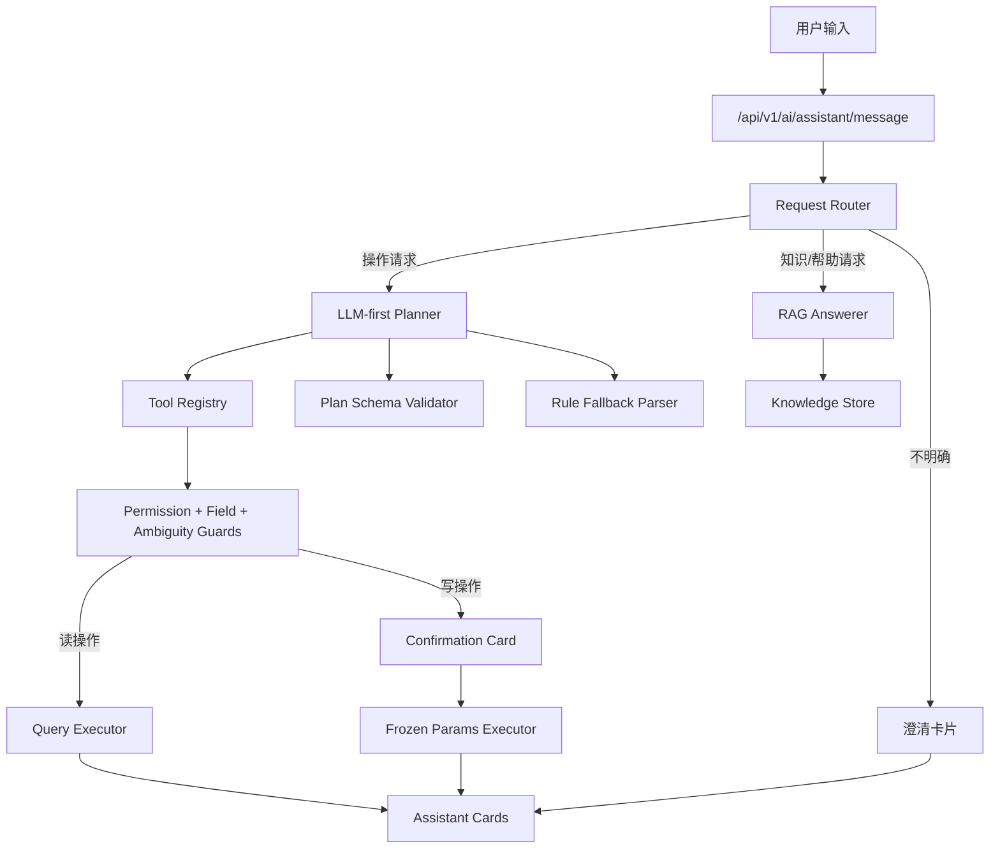

# AI 助手 Planner v2 + RAG 升级规格

## 背景

当前 AI 助手已经完成第一阶段 Planner + Tool Registry 改造，但用户反馈仍有很多简单表达识别不到。现状不是单个关键词缺失，而是主路径仍偏向规则语义匹配：自然语言稍微换一种说法，就可能选错工具、漏解析时间范围、丢失上下文，或把业务歧义当成确定操作。

本规格定义第二阶段升级：让本地 Ollama 结构化 Planner 成为主路径，规则解析降级为 fallback，并引入 RAG 回答系统规则和操作帮助。

## 用户失败样本

以下样本必须进入回归测试集：

| 用户输入 | 期望 |
| --- | --- |
| `2026-05-15有哪些会议` | 查询 2026-05-15 当前用户相关会议 |
| `上周我参加了哪些会议` | 查询上周当前用户发起或参与的会议 |
| `下周我有哪些日程` | 查询下周当前用户日程或预约 |
| `明天9点到11点有哪些会议室可以用` | 查询明天 09:00-11:00 可用会议室 |
| `取消这个会议室` | 不猜测执行，追问用户是要取消预约还是放弃当前会议室选择 |

## 已确认决策

- 升级范围：Planner 主链路升级 + RAG。
- RAG 知识来源：混合方式，先手写核心知识库，再补充从路由、接口、测试清单和 Tool Registry 抽取的结构化资料。
- 模型策略：继续兼容当前 Ollama `qwen2.5:7b`，但架构预留模型、baseUrl、timeout 和 prompt 配置。
- `取消这个会议室`：按业务歧义处理，AI 必须追问，不能直接取消预约或会议室。
- 执行方式：先写规格文档和实施计划，交给全栈 agent 执行。

## 目标

1. 将 LLM Planner 变成助手主路径：默认先让模型基于工具清单输出结构化计划。
2. 将规则解析降级为 fallback：只在模型不可用、返回非法 JSON、低置信或 schema 校验失败时使用。
3. 扩展时间解析：稳定支持过去、未来、具体日期和自然时间段。
4. 增强上下文记忆：支持“这个会”“那个会议室”等引用，但遇到对象类型歧义必须追问。
5. 引入 RAG：回答系统规则、页面说明、操作帮助和常见问题。
6. 保持安全边界：所有业务查询和写操作仍必须经过 Tool Registry、权限校验、参数校验和确认流程。

## 非目标

- 不接外部大模型 API。
- 不让 RAG 直接执行数据库查询或业务写操作。
- 不新增会议室管理、设备管理、通知发布、统计分析等新业务工具。
- 不移除现有 Tool Registry 和 handler 执行器。
- 不继续通过无限补 `contains` 关键词解决主路径问题。

## 目标架构



## 请求路由

助手入口先判断请求类型：

| 类型 | 示例 | 处理方式 |
| --- | --- | --- |
| 操作请求 | `明天有哪些会`、`取消我明天下午的预约` | 进入 Planner，选择工具 |
| 知识请求 | `怎么取消预约`、`审批驳回需要原因吗` | 进入 RAG，回答规则和指引 |
| 混合请求 | `帮我取消明天下午的会议，取消规则是什么` | 先简要说明规则，再进入操作流程 |
| 歧义请求 | `取消这个会议室` | 返回澄清卡片，不执行 |
| 越界请求 | `今天天气怎么样` | 返回能力边界说明 |

请求路由可以用轻量规则辅助，但不得替代 Planner 对操作请求的结构化理解。

## Planner v2

Planner 的模型输出必须是严格 JSON，不允许返回自然语言后再解析。

建议 schema：

```json
{
  "intentType": "operation",
  "toolName": "reservations.list",
  "confidence": 0.92,
  "fields": {
    "dateFrom": "2026-05-15 00:00:00",
    "dateTo": "2026-05-16 00:00:00",
    "targetScope": "mine"
  },
  "missingFields": [],
  "ambiguity": null,
  "reason": "用户询问指定日期有哪些会议，应查询当前用户预约列表。"
}
```

字段要求：

| 字段 | 要求 |
| --- | --- |
| `intentType` | `operation`、`knowledge`、`mixed`、`clarification`、`out_of_scope` |
| `toolName` | 必须是 Tool Registry 中已注册工具；非操作请求为 `null` |
| `confidence` | 0 到 1；低于阈值必须追问或 fallback |
| `fields` | 只能包含 schema 允许字段 |
| `missingFields` | 缺失但可追问的字段列表 |
| `ambiguity` | 对象类型、候选对象或用户意图不明确时必须填写 |
| `reason` | 仅用于日志和调试，不直接展示给用户 |

### 主路径顺序

1. 构造工具清单 prompt。
2. 调用 Ollama 生成结构化 plan。
3. 校验 JSON、schema、toolName、字段类型、权限需求和置信度。
4. 若合法且置信度足够，使用 LLM plan。
5. 若模型不可用、超时、非法 JSON、工具不存在或低置信，使用规则 fallback。
6. 若 fallback 也不确定，返回澄清卡片。

### 规则 fallback 定位

规则 fallback 必须保留，但只承担降级兜底：

- Ollama 未启动。
- Ollama 超时。
- 模型返回非 JSON。
- schema 校验失败。
- toolName 不存在。
- confidence 低于阈值。

fallback 也必须经过同样的 Tool Registry、权限、参数和歧义校验。

## Tool Registry 边界

现有 14 个工具仍是第一批稳定操作能力：

- `overview.summary.query`
- `overview.todaySchedule.query`
- `calendar.query`
- `rooms.search`
- `rooms.detail`
- `reservations.list`
- `reservations.detail`
- `reservations.create`
- `reservations.update`
- `reservations.cancel`
- `reservations.review`
- `admin.reservations.pending`
- `admin.reservations.approve`
- `admin.reservations.reject`

Planner 不能选择未注册工具。RAG 不能绕开工具执行任何业务操作。

## 时间解析要求

必须稳定支持以下时间表达：

| 表达 | 解析 |
| --- | --- |
| `2026-05-15` | 当日 00:00:00 到次日 00:00:00 |
| `今天`、`明天`、`后天`、`大后天` | 对应自然日 |
| `本周`、`上周`、`下周` | 周一 00:00:00 到下周一 00:00:00 |
| `这周末`、`上周末`、`下周末` | 周六 00:00:00 到下周一 00:00:00 |
| `上午`、`下午`、`中午`、`晚上` | 约定时间段 |
| `9点到11点`、`9:00到11:00`、`14:30-16:00` | 精确时间段 |
| `上周我参加了哪些会议` | 上周窗口 + 我的预约 |
| `下周我有哪些日程` | 下周窗口 + 我的预约或日历 |

时间解析应集中在 `AiAssistantTimeResolver`，handler 不应重新用弱正则覆盖已经解析出的 draft 字段。

## 上下文与歧义处理

session 需要保存更多上下文：

- `lastToolName`
- `lastMentionedEntityType`: `reservation`、`room`
- `lastReservationId`
- `lastRoomId`
- `lastQueryResultCandidates`
- `currentTaskType`

引用规则：

- `这个会`、`那个会`、`这场会` 可以引用最近明确预约。
- `这个会议室`、`这间会议室` 可以引用最近明确会议室。
- 如果用户发出写操作，但引用对象类型和操作不匹配，必须追问。

`取消这个会议室` 的标准行为：

- 如果上下文只有会议室，没有明确预约：追问“你是想取消某个预约，还是只是放弃当前选择的会议室？”
- 如果上下文在创建预约流程里选中了会议室：可追问“是否要重新选择会议室？”
- 如果上下文有明确预约且用户说的是“取消这个会”：进入取消预约流程。
- 永远不能直接“取消会议室”，因为系统没有这个业务动作。

## RAG 知识能力

RAG 只回答系统知识，不执行操作。

知识来源：

1. 手写核心知识库：
   - 预约创建规则。
   - 审核规则。
   - 取消和修改规则。
   - 评价规则。
   - 会议室状态说明。
   - 用户和管理员权限说明。
   - 常见问题。
2. 自动抽取结构化资料：
   - Tool Registry 工具清单。
   - 前端路由和页面名称。
   - 后端接口清单。
   - `完整功能测试清单.md` 中的功能说明。

第一阶段可使用轻量关键词检索，不强制引入向量数据库。检索结果必须带知识条目标题，回答不能编造系统规则。

## 前端影响

前端卡片协议可以沿用当前 cards 结构，需确保新增/调整：

- `clarification` 卡片能承载歧义追问。
- `text` 或 `query_result` 卡片能展示 RAG 知识回答。
- 前端不展示“当前消息服务暂时不可用”。
- 写操作仍只通过 `confirmation` 卡片执行。

## 错误与降级

- 模型失败：记录日志，fallback 或追问。
- RAG 无命中：返回能力边界和可尝试问题，不编造。
- 工具不存在：返回能力边界。
- 参数缺失：返回字段补充卡片。
- 对象歧义：返回澄清卡片。
- 权限不足：返回错误卡片。
- 写操作业务失败：返回执行结果或错误卡片。

## 验收标准

必须通过：

1. `2026-05-15有哪些会议` 查询指定日期会议。
2. `上周我参加了哪些会议` 查询上周我的预约。
3. `下周我有哪些日程` 查询下周我的预约或日历。
4. `明天9点到11点有哪些会议室可以用` 查询可用会议室，不能忽略时间段。
5. `取消这个会议室` 返回澄清，不执行。
6. Ollama 正常时，操作请求优先使用 LLM Planner。
7. Ollama 关闭时，上述查询类请求仍 fallback 成功或合理追问。
8. RAG 能回答“怎么取消预约”“审批驳回需要填原因吗”。
9. RAG 回答不能执行写操作。
10. 普通用户不能通过 Planner 或 RAG 执行管理员工具。
11. 所有写操作仍先确认，再执行冻结参数。
12. 前端不出现“当前消息服务暂时不可用”。

## 测试要求

后端：

- Planner v2 schema 校验测试。
- LLM-first 主路径测试。
- LLM 失败 fallback 测试。
- 时间解析回归测试。
- 上下文歧义测试。
- RAG 检索与回答测试。
- 权限和确认流程回归测试。

前端：

- 澄清卡片渲染。
- RAG 文本卡片渲染。
- 字段补充和确认卡片回归。
- 接口异常兜底展示。

手工：

- 将本规格中的 5 条失败样本逐条加入 `完整功能测试清单.md` 并实际验证。

