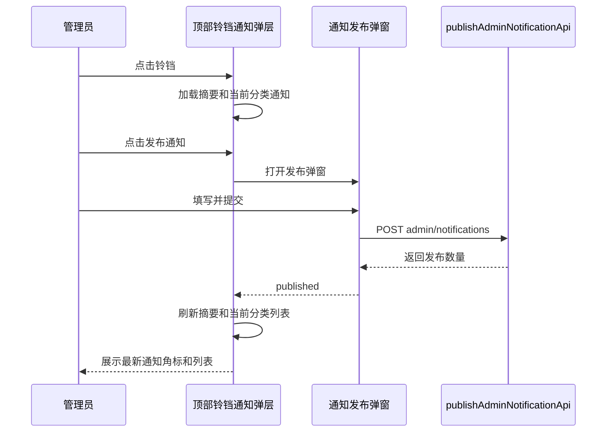

# 管理员通知发布弹窗规格

## 背景

当前系统已经有通知读取、未读角标、通知列表和管理员通知发布接口。前端现有 `通知发布` 独立页面只承载一组发布表单：发布类型、接收范围、标题、内容和发布按钮。这个功能低频、动作型强，单独占用管理端菜单页面显得过重。

本次调整将通知发布入口收敛到顶部导航的铃铛通知弹层中。管理员在查看通知时可以直接发布通知，普通用户只看到通知列表。

## 目标

1. 管理员只在顶部导航铃铛弹层中看到 `发布通知` 按钮。
2. 点击 `发布通知` 后弹出发布弹窗。
3. 弹窗复用现有通知发布能力，不改变后端接口和数据结构。
4. 发布成功后刷新铃铛未读数量和当前通知列表。
5. 管理端侧边菜单不再展示 `通知发布` 独立页面。

## 非目标

1. 不新增后端接口。
2. 不新增数据库字段或表。
3. 不做通知发布记录、草稿、模板、撤回、定时发布、已读统计。
4. 不改变普通用户查看通知的体验。
5. 不重设计整体顶部导航或通知列表。

## 当前实现

相关前端位置：

- `frontend/src/common/components/Notify/index.vue`：顶部导航铃铛通知弹层，负责通知摘要、分类列表、标记已读和跳转。
- `frontend/src/pages/admin/notifications/index.vue`：现有管理员通知发布页面。
- `frontend/src/common/apis/notifications/index.ts`：已有 `publishAdminNotificationApi`。
- `frontend/src/common/apis/notifications/type.ts`：已有发布请求和响应类型。
- `frontend/src/router/index.ts`：动态路由中有 `AdminNotifications`，标题为 `通知发布`。

## 权限规则

1. 只有当前用户角色包含 `admin` 时，铃铛弹层显示 `发布通知` 按钮。
2. 普通用户不显示按钮，也不能通过前端入口打开发布弹窗。
3. 后端仍然是最终权限边界；如果普通用户绕过前端直接调用管理员发布接口，后端应继续拒绝。

## 交互设计

### 铃铛弹层

在现有通知弹层底部增加一个管理员专属操作区。

显示规则：

- 管理员：显示 `发布通知` 按钮。
- 普通用户：不显示该按钮，保持现有通知列表和 `全部标记已读` 行为。

推荐位置：

- 放在通知弹层底部操作区，靠左或靠右均可。
- 不挤压现有 `全部标记已读` 操作。
- 如果底部空间不足，可以使用两行布局：第一行未读状态和全部已读，第二行管理员发布按钮。

### 发布弹窗

点击 `发布通知` 后打开 Element Plus 弹窗。

弹窗字段：

- 发布类型：`系统公告` / `维护通知`
- 接收范围：`全体成员` / `普通用户` / `管理员`
- 通知标题：必填，最大长度沿用现有类型约束和输入框设置
- 通知内容：必填，最大长度沿用现有类型约束和输入框设置

弹窗按钮：

- 取消：关闭弹窗，不提交。
- 发布：校验必填字段，通过后调用 `publishAdminNotificationApi`。

发布成功：

- 展示 `已发布给 N 个接收人`。
- 关闭弹窗。
- 清空表单。
- 刷新通知摘要。
- 如果当前激活分类是 `通知`，刷新当前通知列表。

发布失败：

- 弹窗保持打开。
- 展示 `通知发布失败，请稍后重试`。
- 不清空用户已输入内容。

## 组件设计

### 新组件

建议新增：

- `frontend/src/common/components/Notify/AdminNotificationPublishDialog.vue`

职责：

- 持有发布表单状态。
- 做标题和内容必填校验。
- 调用 `publishAdminNotificationApi`。
- 成功后向父组件发出 `published` 事件。
- 不直接管理通知列表刷新。

推荐事件：

- `update:modelValue`：控制弹窗开关。
- `published`：发布成功，参数包含 `publishedCount`、`title`、`recipientScope` 等后端返回数据。

### 现有 Notify 组件调整

`frontend/src/common/components/Notify/index.vue` 负责：

- 判断是否管理员。
- 控制发布弹窗显示。
- 监听 `published` 事件后刷新通知摘要和当前分类列表。

管理员判断建议优先使用当前 Pinia 用户状态：

- `useUserStore().roles.includes("admin")`

如果项目里已有统一权限工具，应优先复用现有工具。

### 原页面处理

`frontend/src/pages/admin/notifications/index.vue` 的发布表单逻辑迁移到新弹窗组件后，删除或停止使用原独立页面。

`frontend/src/router/index.ts` 中移除 `AdminNotifications` 动态路由，避免侧边菜单继续出现 `通知发布`。

如果为了兼容历史地址保留路由，则必须隐藏菜单入口，并将页面重定向到合适位置。但本次推荐直接移除动态路由，因为该功能已迁移到顶部铃铛入口。

## 数据流

## 验收标准

1. 管理员登录后，点击顶部铃铛能看到 `发布通知` 按钮。
2. 普通用户登录后，点击顶部铃铛看不到 `发布通知` 按钮。
3. 管理员点击 `发布通知` 后弹出发布弹窗。
4. 标题为空时不能发布，并提示 `请输入通知标题`。
5. 内容为空时不能发布，并提示 `请输入通知内容`。
6. 发布成功后提示 `已发布给 N 个接收人`。
7. 发布成功后弹窗关闭，表单清空。
8. 发布成功后通知摘要和当前通知列表刷新。
9. 管理端侧边栏不再出现 `通知发布` 菜单。
10. 不新增后端接口、数据库字段或业务表。

## 测试要求

前端测试至少覆盖：

1. 管理员角色渲染 `发布通知` 按钮。
2. 普通用户角色不渲染 `发布通知` 按钮。
3. 点击按钮打开发布弹窗。
4. 标题为空时阻止提交。
5. 内容为空时阻止提交。
6. 发布成功后调用 `publishAdminNotificationApi`，关闭弹窗并触发刷新。
7. 发布失败后弹窗不关闭，表单内容保留。
8. 动态路由不再包含 `AdminNotifications` 菜单项。

真实浏览器检查：

1. 管理员在 `5172` 前端服务中点击顶部铃铛，能看到并打开发布弹窗。
2. 普通用户在顶部铃铛中看不到发布入口。
3. 弹窗在桌面宽度下不遮挡顶部导航和通知弹层关键操作。

## 实施边界

1. 只改前端入口和组件结构。
2. 不改后端接口，除非发现现有权限校验缺失；若缺失，只补权限校验和测试。
3. 不引入新依赖。
4. 保持当前 Element Plus、Vue 3、Pinia、Vite 技术栈。
5. 不提交 git commit，除非用户明确要求。
